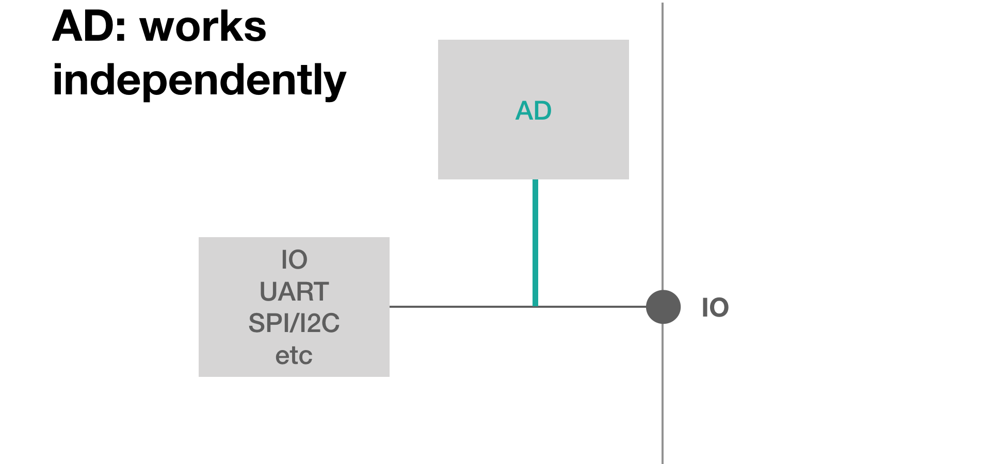

# Peripheral AD
ピンの電圧読み取りができます。
obnizにあるピン全てで利用可能です。
ad0(io0)からad11まであります。

開始後は電圧の変化のみが通知されます。

```Javascript
// Javascript Example
obniz.ad0.start(function(voltage){
  console.log("changed to "+voltage+" v")
});
obniz.ad1.start(function(voltage){
  console.log("changed to "+voltage+" v")
});
```

#### 特徴
##### 12ch 同時に
同時に12chつかうことができます。サンプリングレートには影響しません。
##### 30 samples/sec かそれ以下で
サンプリングレートはあなたのネットワークの速度と、obnizのファームウェアバージョンに依存します。例えばver1.0.0なら最大30samples/secです。
##### 10bit - VDD 補正
adはobnizの電源電圧も監視していて、電源電圧が変動してもそれぞれのadの結果が正しくなるように補正を行います。また精度は10bitです。
(補正の挙動はobnizのファームウェアのバージョンによって異なります)

ファームウェアバージョン|補正方法
---|---
1.2未満|常に補正
1.2以上|電源電圧が4.5vを下回ったときのみ補正

##### ad は io-output/uart/spi と同時に利用可能
adコンバーターの回路は独立しています。IOやUARTが使っているioでもつかうことができます。



Example: UARTと同時につかう
```Javascript
obniz.uart0.start({tx:0, rx:1}) // works with uart
obniz.ad0.start(function(voltage){
  console.log(voltage)
});
```

## start(callback)
X番ピンでの電圧計測を開始します。
X番ピンの電圧が変わったときはコールバック関数を呼び出します。

```Javascript
// Javascript Example
obniz.ad0.start(function(voltage){
  console.log("changed to "+voltage+" v")
});
```
callbackはなくても大丈夫です。
後で設定することも可能です。

```Javascript
// Javascript Example
obniz.ad0.start();
obniz.ad0.onchange = function(voltage){
  console.log("changed to "+voltage+" v")
}
```

また、関数を使わなくても値は`value`に保存されるので、それを読み出すこともできます。

注意：この変数には最後に受け取ったadの値が入っています。この変数を読んだ時のadの値ではありません。

```Javascript
// Javascript Example
obniz.ad0.start();
while(true) {
  console.log("changed to "+obniz.ad0.value+" v")
  await obniz.wait(1); // 1ms wait
}
```
## [await] getWait()
adを１度だけ実行して値を受け取ります。
adを実行し、結果が返ってくるまで関数は停止します。

```Javascript
// Javascript Example
obniz.io0.output(true)
var voltage = await obniz.ad0.getWait();
obniz.io0.output(false)
console.log(""+voltage+" should be closed to 5.00");
```
## end()
Xピンでの電圧計測を停止します。

```Javascript
// Javascript Example
obniz.ad0.start();
obniz.ad0.end();
```
## onchange
callback関数はstartした後にも設定できます。

```Javascript
// Javascript Example
obniz.ad0.start(); // start a/d at io0
obniz.ad0.onchange = function(voltage) {
  console.log("voltage = "+voltage);
}
```