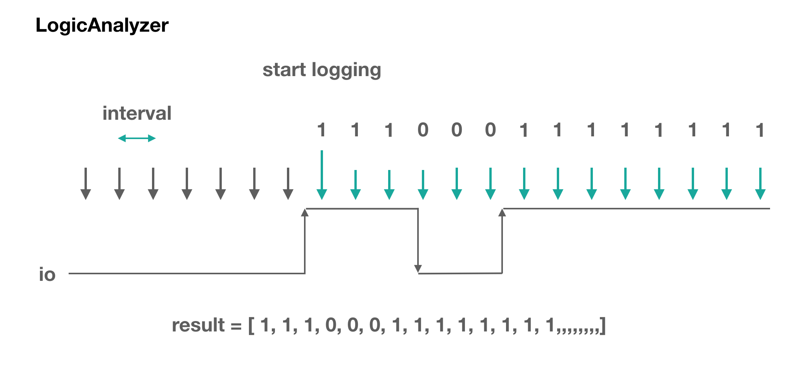

# LogicAnalyzer
ピンの状態を監視し、一定間隔で1,0の状態を取得します。
信号が送られているかの確認などに利用できます。
obnizで利用できるLogicAnalyerは1つのみです。

### How work

ロジックアナライザーはトリガーをきっかけに開始します。
デフォルトトリガーは「ioの変化」です。
ioが変化した後のioの変化を指定された時間記録します。
完了し、データを送信したら再度、ioの変化を待ちます(つまり継続動作します)



サンプリングの間隔と欲しいサンプルの時間を指定できます。
例えばinterval（間隔）が1msでduration(長さ)を800msにした場合は800サンプルを受けることになります。
また、サンプル数は必ず8の倍数となります。

### Trigger Option

デフォルトトリガーは「ioの変化」ですが、これですとノイズも取得しがちです。信号の開始が決まっているパターンを取りたい場合はtriggerValue/triggerValueSamplesを設定します。

1. triggerValue - 取得開始したい値
2. triggerValueSamples - その値が何サンプル続けば記録することにするか

このトリガーはつまり "true/(かfalse)がXだけ続いたら記録を開始する"という意味になります。


## logicAnalyzer.start({io, interval, duration});

指定したioでのロジックアナライザーをスタートさせます。ioは1つだけ指定できます。
モニター間隔と全体の時間を指定できます。
ピンに状態の変化がない場合。もしくは、変化があっても検出できないぐらい短かった場合は何もデータを受け取ることが出来ません。
変化が見つかってから決められた間隔・決められた時間分のデータを受け取れます。
データの受け取り方はonmeasured callbackを設定するか、もしくはmeasured変数から読み出す方法があります。
例えば変化があってから2msごとに1秒分のピンの1,0を取得したい場合は以下のように設定します。

```Javascript
// Javascript Example
obniz.logicAnalyzer.start({io:0, interval:2, duration:1000});  // start on io0. 2ms interval and 1sec long.
obniz.logicAnalyzer.onmeasured = function(array) {
  console.log(array);
}
```
## logicAnalyzer.start({io, interval, duration, triggerValue, triggerValueSamples});
triggerを指定することができます。 これなしでは、全てのioの状態変化をトリガーとして動き始めます。 トリガーにより測定を開始したい値とその数を指定できます。 例えば、下の例であればfalseが3回続いたデータのみ計測します。
```Javascript
// Javascript Example
obniz.logicAnalyzer.start({io:0, interval:2, duration:1000, triggerValue:false, triggerValueSamples:3});  // start on io0. 2ms interval and 1sec long.
obniz.logicAnalyzer.onmeasured = function(array) {
  console.log(array);
}
```

## logicAnalyzer.onmeasured

実際にデータを受け取るためのcallbackです。
データはioのピン状態の配列になっています。
1つがある瞬間のioの0,1を表しています。

```Javascript
// Javascript Example
obniz.logicAnalyzer.start({io:0, interval:2, duration:1000});  // start on io0. 1ms interval and 1sec long.

obniz.logicAnalyzer.onmeasured = function(array) {
  console.log(array);
}
```
## logicAnalyzer.end()

ロジックアナライザーを停止します。

```Javascript
// Javascript Example
obniz.logicAnalyzer.start({io:0, interval:2, duration:1000});  // start on io0. 1ms interval and 1sec long.
obniz.logicAnalyzer.end();
```