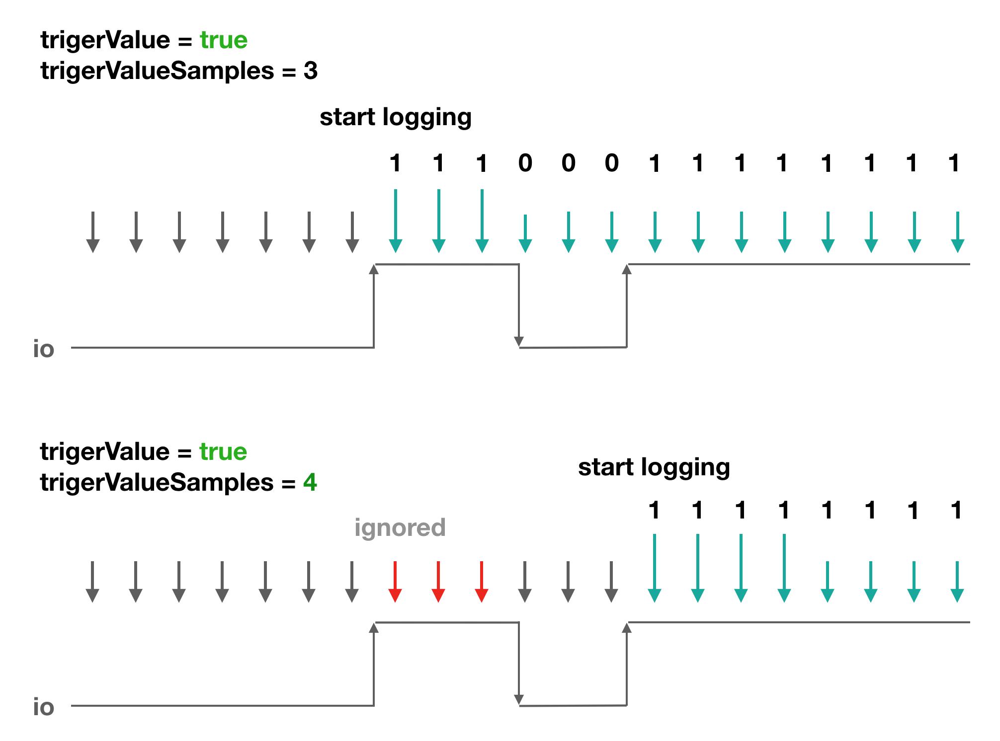

# LogicAnalyzer
LogicAnalyzer records samples read from io periodically.
This is useful for digital bus signal check.
Only one LogicAnalyzer can be used per obniz.

### How it works

LogicAnalyzer starts logging by a trigger.  
The default trigger is "value change".
When it occurs, data will be recorded for a desired duration.
After that is done, LogicAnalyzer starts monitoring changes in io (= continue working).
One sample becomes one 1/0.


Sampling interval and duration can be configured.
For example, if interval is 1 ms and duration is 800ms, you will get 800 arrays of data.
The data will be in multiples of 8.

### Trigger Option

The default trigger is "value change", but it tends to be interrupted by some noise. Configure triggerValue/triggerValueSamples to filter it.

1. triggerValue - desired start value. true/false
2. triggerValueSamples - after how many samples will the recording start.

This trigger setting means "trigger when true/(or false) continues for more than X times after io change"




## logicAnalyzer.start({io, interval, duration});
This starts the logic analyzer on a given io.
Interval means a period(second) to read io value.
data_long means for how long the logicAnalyzer will collect the data.

For example, if you want to collect the data after io0 changes every 2ms for 1sec long, set as below.
```Javascript
// Javascript Example
obniz.logicAnalyzer.start({io:0, interval:2, duration:1000});  // start on io0. 2ms interval and 1sec long.
obniz.logicAnalyzer.onmeasured = function(array) {
  console.log(array);
}
```
## logicAnalyzer.start(io, interval, duration, triggerValue, triggerValueSamples);
This starts the logicAnalyzer on a given io with trigger.

The trigger is an optional configuration.
Without this, logicAnalyzer recognizes any io level change as trigger and start. Trigger specifies the start position.
Value means start value, true/false. Samples means how much that value consists.
So, with the below sample code, you will only receive data that start with "0, 0, 0" 
```Javascript
// Javascript Example
obniz.logicAnalyzer.start({io:0, interval:2, duration:1000, triggerValue:false, triggerValueSamples:3});  // start on io0. 2ms interval and 1sec long.
obniz.logicAnalyzer.onmeasured = function(array) {
  console.log(array);
}
```

## logicAnalyzer.onmeasured(bytes)
This is a callback function that will be called when data arrives.
The received data is in 0/1 array.
And every data represents 0,1 of io in a particular instance.

```Javascript
// Javascript Example
obniz.logicAnalyzer.start({io:0, interval:2, duration:1000});  // start on io0. 1ms interval and 1sec long.

obniz.logicAnalyzer.onmeasured = function(array) {
  console.log(array);
}
```
## logicAnalyzer.end()
This stops the logicAnalyzer.

```Javascript
// Javascript Example
obniz.logicAnalyzer.start({io:0, interval:2, duration:1000});  // start on io0. 1ms interval and 1sec long.
obniz.logicAnalyzer.end();
```