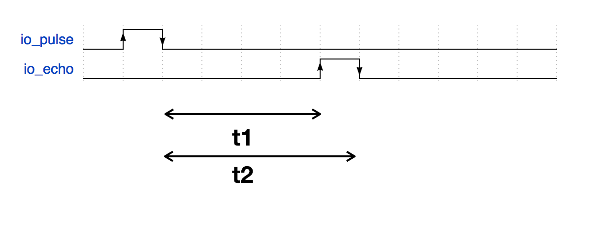

# measure
measureモジュールではパルスの立ち上がりなど，時間の計測を行うことができます．

## measure.echo({})

パルスを作成し，エコーが返ってくるまでの時間を計測します，


### pulse作成パラメータ
パルス作成のために次の３つのパラメータを設定します

1. io_pulse: パルスを作成するioの番号
2. pulse: "positive" もしくは "negative"
3. pulse_width: パルスの時間(ms). 0.001 〜 1000.


### echoの計測パラメータ
エコーを計測関連のパラメータは４つあります．

1. io_echo: エコーが帰ってくるioの番号
2. measure_edges: 検出する立上り／立ち下がりエッジの数．
3. timeout: タイムアウトまでの時間(ms). デフォルトは1000msです. 0.001 〜 1000.
4. callback: 計測が完了したら（もしくはタイム・アウトしたら）呼ばれるコールバック関数

もし次の図のようなエコーが返ってきたら，コールバック関数には次のようなオブジェクトが渡されます．



Then, you will get like this
```javascript
callback: function(edges) {
  edges.length // == 2
  edges[0].edge // == true
  edges[0].timing // == t1
  edges[1].edge // == false
  edges[1].timing // == t2
}
```

Full Example

```javascript
// Javascript Example
obniz.measure.echo({
  io_pulse: 0, // io for generate pulse
  io_echo: 1, // io to be measured
  pulse: "positive", // generate pulse pattern
  pulse_width: 0.1,  // generate pulse width
  measure_edges: 3, // 1 to 4. maximum edges to measure
  timeout: 1000, // this is optional. 1000(1sec) is default
  callback: function(edges) {
    // callback function
    console.log(edges);
  }
});
```
