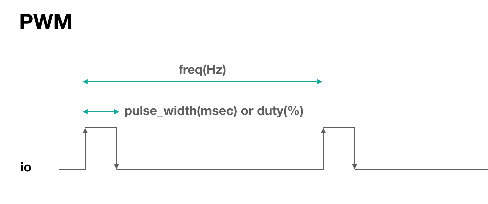
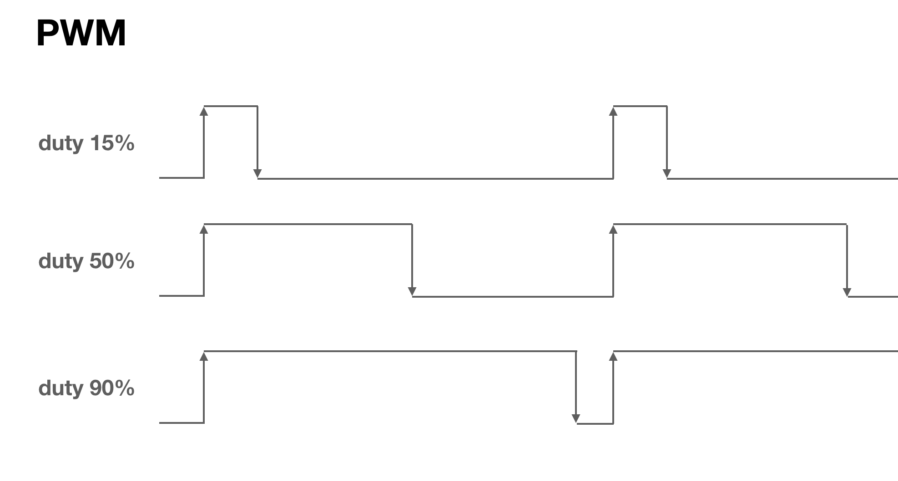
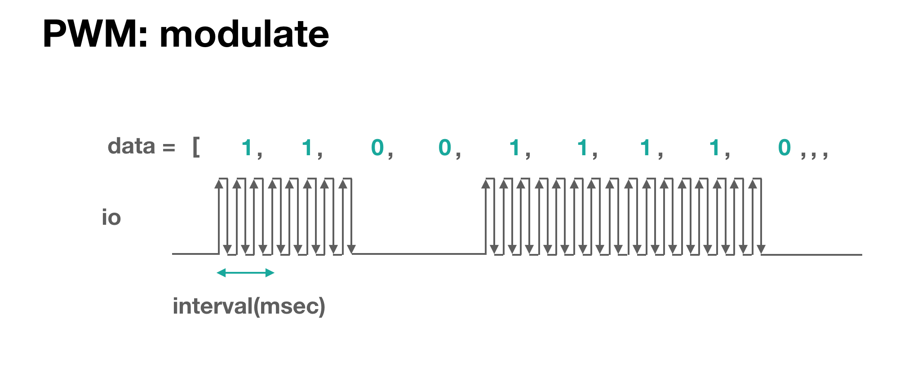

# Peripherals PWM
We will now generate PWM.
Maximum current depends on the driving mode. See [io](./io).

6 modules (pwm0 to pwm5) are available.

PWM repeatedly generates pulse.
Two parameters define the pulse.

1. freq: pattern interval
2. pulse_width or duty: positive pulse width



pwm is often used for controlling a DC motor by changing its duty.



## obniz.getFreePwm()
This returns pwm module that is currently not used.

```Javascript
// Example
var pwm = obniz.getFreePwm();
```
It will show Error when there is no free pwm.
```Javascript
// Example
var pwm0 = obniz.getFreePwm();
var pwm1 = obniz.getFreePwm();
var pwm2 = obniz.getFreePwm();
var pwm3 = obniz.getFreePwm();
var pwm4 = obniz.getFreePwm();
var pwm5 = obniz.getFreePwm();
var pwm6 = obniz.getFreePwm(); // Error
```

## start({io [,drive, pull]})
This starts a pwm on a given io.
freq=1khz, duty=0% at start.

io drive and pull can be configured. See more details on [io](./io)

```Javascript
// Javascript Example
var pwm = obniz.getFreePwm();
pwm.start({io:0}); // start pwm. output at io0
pwm.freq(1000);
pwm.duty(50);

var pwm2 = obniz.getFreePwm();
pwm2.start({io:1, drive:"open-drain", pull:"5v"});
```
## freq(frequency)
Set frequency, not pulse duration.
For example, this value will be 1khz with DC motor.

```Javascript
// Javascript Example
var pwm = obniz.getFreePwm();
pwm.start({io:0});
pwm.freq(1000); // set pwm. frequency to 1khz
```
## pulse(width ms)
Set pulse duty in terms of ms.

```Javascript
// Javascript Example
var pwm = obniz.getFreePwm();
pwm.start({io:0});
pwm.freq(2000); // set pwm frequency to 2khz
pwm.pulse(0.5) // set pwm pulse 0.5ms.  so this is  25% ratio.
```
## duty(ratio)
Set pulse duty in terms of ratio.

```Javascript
// Javascript Example
var pwm = obniz.getFreePwm();
pwm.start({io:0});
pwm.freq(2000); // set pwm frequency to 2khz
pwm.duty(50) // set pwm pulse width 50%
```

## modulate(modulation type, interval ms, data)
This modulates pwm with data.
Modulation can be chosen from below.

1. "am"

am modulation: data "1" means put out the pwm with duty ratio of 50%. "0" means stop pwm. io will be 0.
Interval defines the symbol baud rate. 
Duty is fixed at 50%.



This is useful to generate IR signal (Remote control).
Frequency of 38kHz gets modulated with signals.

```Javascript
// Javascript Example
var pwm = obniz.getFreePwm();
pwm.start({io:0});
pwm.freq(38000); // set pwm frequency to 38khz

// signal for room heater's remote signal
var arr = [0,0,0,0,0,0,0,0,0,0,0,0,0,0,0,1,1,1,1,1,1,1,1,1];

pwm.modulate("am", 0.07, arr); // am modulate. symbol length = 70us.
```
## end();
It stops pwm and releases io.

```Javascript
// Javascript Example
var pwm = obniz.getFreePwm();
pwm.start({io:0});
pwm.end();
```