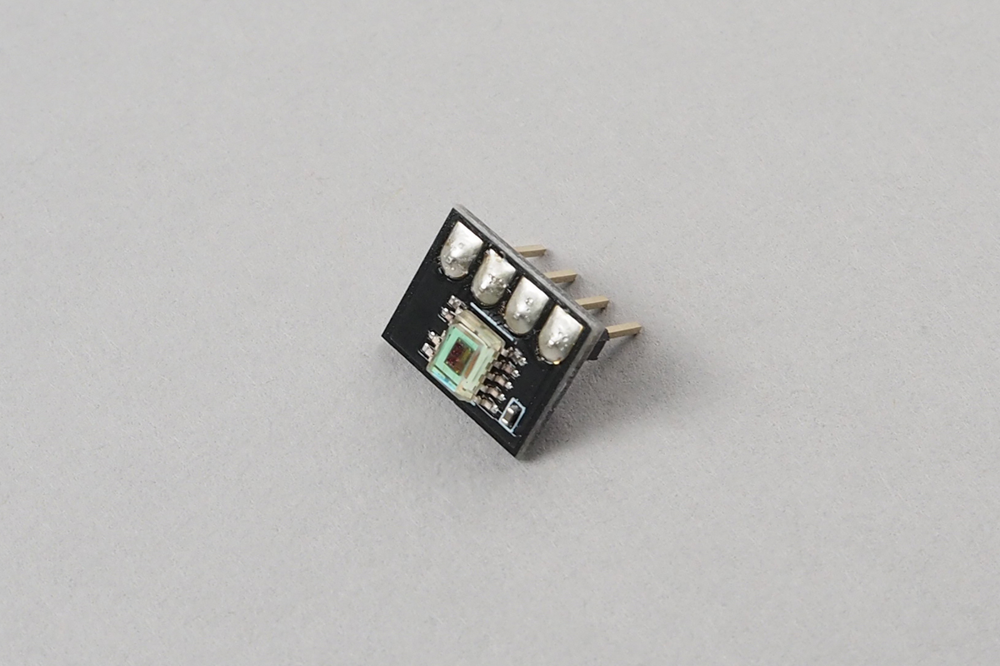

# S11059
カラーセンサS11059-02DTから赤,緑,青,赤外のそれぞれの色のレベルを取得します。




## wired(obniz,  { vcc, sda, scl, gnd});

1. vcc: 電源のプラス(3.3V)です。
2. sda: I2CのSDAです。S11059-02DTのSDAピンへ接続してください。
3. scl: I2CのSCLです。S11059-02DTのSCLピンへ接続してください。
4. gnd: 電源のマイナスです。

この部品の電源は3.3vです。obnizから供給する場合はレギュレーターを使って5vから3.3vを作る方法が安定して利用できます。

ライブラリではobnizから3.3vを出力して、電源を供給していますが、部品によってはそれでは不足となりエラーが出る可能性があります。

```Javascript
// Javascript Example
var colorSens = obniz.wired("S11059", {vcc:0, sda:1, scl:2, gnd:3});
```

## init(Gain, IntergerTime)
デバイスを初期化します。

1. Gain : センサのゲインを指定します。1でHigh(高感度)、 0でLow(低感度)になります。
2. IntergerTime: 積分時間を0~3で指定します。積分時間が長いほど高感度になります。具体的な時間は以下に示す通りです。

 - 0:87.5uS
 - 1:1.4ms
 - 2:22.4ms
 - 3:179.2ms

```Javascript
// Javascript Example
var colorSens = obniz.wired("S11059", {vcc:0, sda:1, scl:2, gnd:3});
colorSens.init(1,2); // ゲイン高感度, 積分時間22.4msで初期化
```

## [await] getVal()
センサから値を取得します。各色の強さが数値の配列として返されます。

[赤, 緑, 青, 赤外線]

という配列になります。各値は0~0xFFFFの間となります。

```Javascript
// Javascript Example
var colorSens = obniz.wired("S11059", {vcc:0, sda:1, scl:2, gnd:3});
colorSens.init(1,2);
var ret = await colorSens.getVal(); // 各色の値を取得
console.log("getVal:"+ ret); // 取得した配列を表示
var red = ret[0]; // 赤色のレベルを変数redへ代入
var green = ret[1];　// 緑色のレベルを変数greenへ代入
var blue = ret[2];　// 青色のレベルを変数blueへ代入
var ir = ret[3];　// 赤外線のレベルを変数irへ代入
// それぞれの配列を表示
console.log("Red:"+ red);
console.log("Green:"+ green);
console.log("Blue:"+ blue);
console.log("IR:"+ ir);
```
