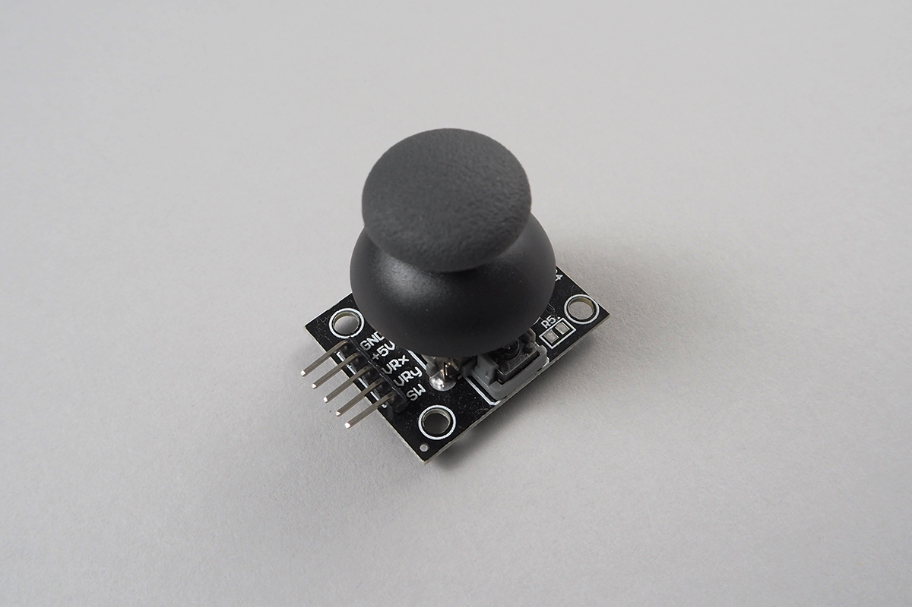
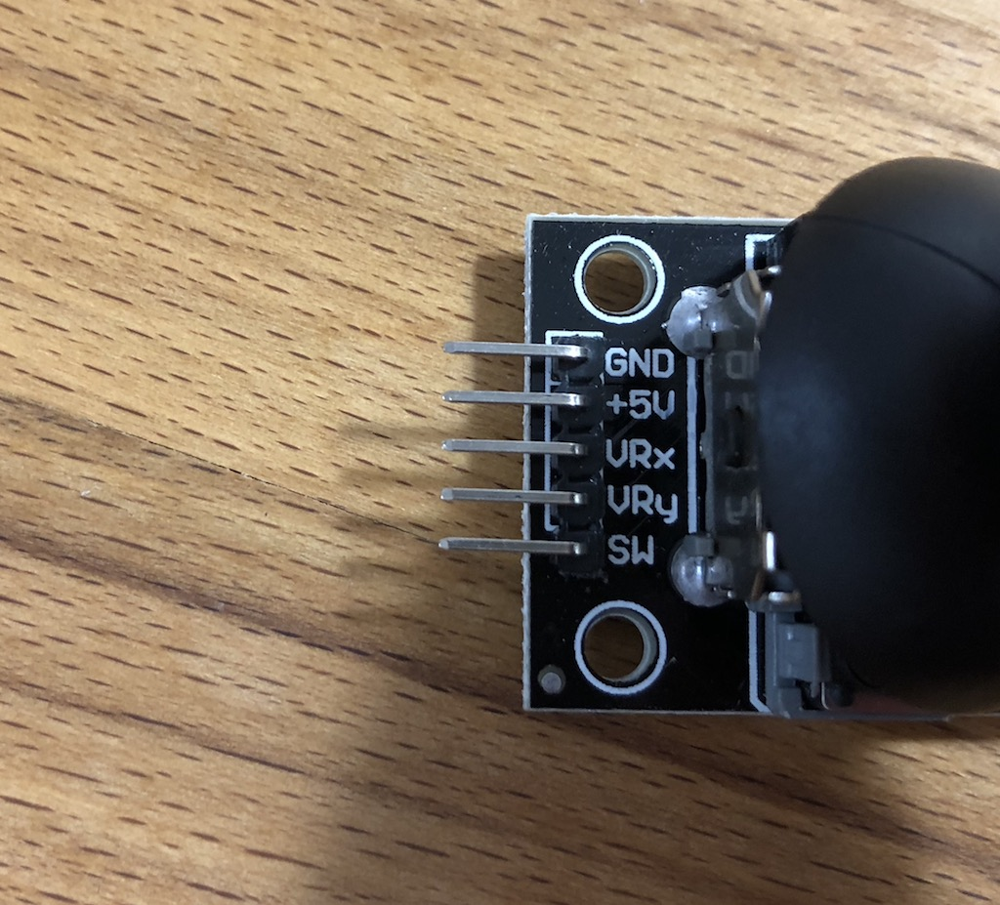

# JoyStick
X軸Y軸とプッシュスイッチをもつジョイスティックです。出力がアナログ値の一般的なものに対して利用できます。



## wired(obniz, {sw, x, y, vcc, gnd})
obnizと接続します。vccはジョイスティックの5v入力へ。gndはマイナスへ接続します。  
sw: スイッチ  
x: x軸のアナログ値出力  
y: y軸のアナログ値出力  
へ接続して下さい

### 注意！いろいろな製品があります！
ジョイスティックは製品によってピン配置が違うので注意して下さい。
例えば、obnizでよく使われるのはこのピンアサインのものですが


他にもこのようなピンアサインのものもあります。


```Javascript

var joystick = obniz.wired("JoyStick", {gnd:4, sw:0, y:1, x:2, vcc:3});

// or

var joystick = obniz.wired("JoyStick", {gnd:0, sw:1, y:2, x:3, vcc:4});

// and mores
```
## onchangex(callback)
## onchangey(callback)
それぞれX軸，Y軸方向へ動いた場合に呼ばれる関数を指定できます。
```Javascript
// Javascript Example
var joystick = obniz.wired("JoyStick", {gnd:4, sw:0, y:1, x:2, vcc:3});
joystick.onchangex = function(val){
  console.log(val);
};

joystick.onchangey = function(val){
  console.log(val);
};
```

## onchangesw(callback)
ボタンが押されたり離された時に呼ばれます。
```Javascript
// Javascript Example
var joystick = obniz.wired("JoyStick", {gnd:4, sw:0, y:1, x:2, vcc:3});
joystick.onchangesw = function(pressed){
  console.log(pressed);
};
```


## [await] isPressedWait()
ボタンが押されているかどうかを一度だけ取得します

```Javascript
// Javascript Example
var joystick = obniz.wired("JoyStick", {gnd:4, sw:0, y:1, x:2, vcc:3});
var isPressed = await joystick.isPressedWait()
if(isPressed){
  console.log("PRESSED");
}

```


## [await] getXWait()
## [await] getYWait()

X,Yそれぞれの傾きを一度だけ取得します

```Javascript
// Javascript Example
var joystick = obniz.wired("JoyStick", {gnd:4, sw:0, y:1, x:2, vcc:3});
var x = await joystick.getXWait()
var y = await joystick.getYWait()
 
console.log("x:" + x + " y:"+y);

```